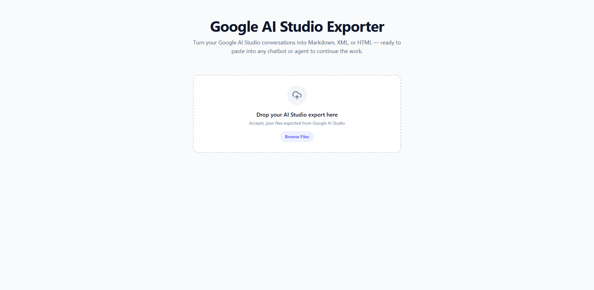
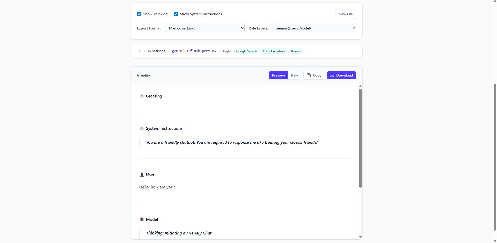

# Google AI Studio Exporter

A small web tool that converts Google AI Studio conversation exports (`.json`) into clean **Markdown**, **XML**, or **HTML** — ready to paste into another chatbot or agent to continue the work.

Exports from [aistudio.google.com](https://aistudio.google.com) are intended for Gemini only. This tool restructures them into portable formats suitable for cross-chatbot continuation.


<!-- HERO -->

*Drop an AI Studio `.json` export onto the drop zone, or browse for one.*

## Features

- **Drag-and-drop upload** — the preview re-renders live when any option changes.
- **Thinking & system instructions toggles** — keep them or strip them for a cleaner paste.
- **Role labels** — pick the chatbot you're pasting into (Gemini, ChatGPT, Claude, Grok, Llama, Mistral, or DeepSeek) and the labels match.
- **Streamed prose reassembled** — merged so Chinese / Japanese / continuous prose does not break mid-sentence.
- **Code-execution preserved** — both the Gemini-generated source and its output are kept as separate blocks.
- **Copy or download** — correct file extension and MIME type per format.

## Output Formats

- **Markdown** — universal and portable.
- **XML** — structured `<turn role="user" | "assistant">`. Good for Claude-style re-ingestion.
- **HTML** — self-contained styled document, openable in any browser.

## Preview

After upload — toggle thinking and system instructions, pick an output format and role labels, inspect run settings, then preview, copy, or download.



## How It Works

Parse once, format many.

```text
JSON ─▶ parser ─▶ IR ─┬─▶ markdown
                      ├─▶ xml
                      └─▶ html
```

Adding a new format is one file in `lib/formatters/` plus one entry in the registry.

## Project Structure

```text
aistudio-exporter/
├── app/                    # Next.js App Router pages
├── components/             # React UI components
│   ├── client-page.tsx
│   ├── file-uploader.tsx
│   ├── metadata-panel.tsx
│   └── output-preview.tsx
├── lib/
│   ├── parser.ts           # JSON export → intermediate representation (IR)
│   ├── types.ts            # IR types (ConversationIR, Turn, ContentPart, …)
│   └── formatters/
│       ├── index.ts        # Registry of output formats
│       ├── markdown.ts
│       ├── xml.ts
│       ├── html.ts
│       └── shared.ts
├── public/                 # Static assets (screenshots, icons)
└── package.json
```

## Prerequisites

1. **Node.js** v20 or higher.
2. **npm** (bundled with Node.js).

## Setup

### 1. Clone and install
```bash
git clone https://github.com/Xd06eR/aistudio-exporter.git
cd aistudio-exporter
npm install
```

### 2. Start the dev server
```bash
npm run dev
```

### 3. Open the app
Visit [http://localhost:3000](http://localhost:3000) and drop in a `.json` exported from Google AI Studio (see below for how to get one).

## Exporting from Google AI Studio

Google AI Studio autosaves every prompt to your Google Drive — there is no direct "Export" button in the AI Studio UI. To get the `.json` file:

1. Open [Google Drive](https://drive.google.com).
2. Go to the **Google AI Studio** folder (created automatically the first time you save a prompt in AI Studio).
3. Find the prompt you want to export — files are named after the prompt title.
4. Right-click the file → **Download**. It downloads as a `.json` file.
5. Drop that file into this tool.

> **Tip:** if you don't see the folder, open a prompt in [aistudio.google.com](https://aistudio.google.com) and click **Save** once. Drive will create the folder on first save.

## Limitations

- **User attachments** (`driveDocument`, `driveImage`, `youtubeVideo`) are not extracted — the export only stores a reference (e.g. a Drive file ID or YouTube video ID), and resolving the underlying content requires the corresponding API. Turns whose only content is such an attachment are dropped, so a follow-up question that refers back to one ("what is in this video?") may appear without its referent.
- **Google Search grounding metadata** (citations, web queries, source URIs from `chunk.grounding`) is not extracted into the output.
- **Run settings** displayed in the metadata panel reflect the current AI Studio toggle state at the time of export, not what the conversation actually used — e.g. `codeExecution` may read `false` in a file that contains code-execution chunks.
- Other attachments (uploaded images, inline files) are rendered as a generic `[Image/Media Attachment]` placeholder.

## Stack

- Next.js 16
- React 19
- TypeScript
- Tailwind CSS v4
- `react-markdown`, `remark-gfm`, `marked`, `lucide-react`

## Contributing

Contributions are welcome. Open an issue or submit a pull request for bug reports, feature ideas, or format additions.
